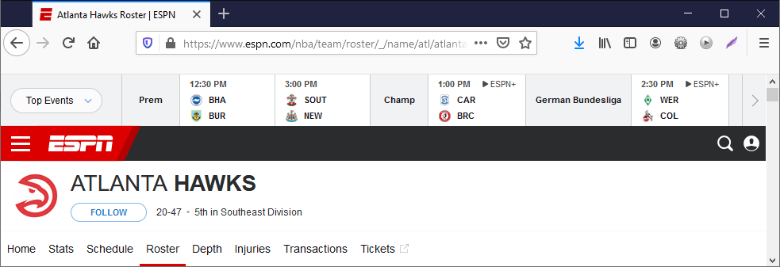
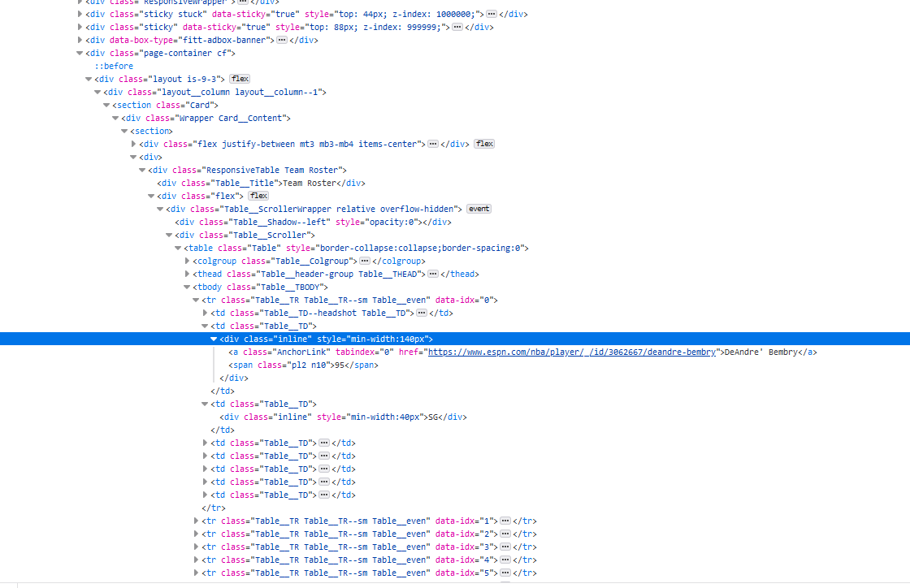

# Web Scraping using Beautiful Soup


## Summary

This study is part of a serie of statistical analysis in the composition and salary earned by main and key players in the NBA.

I am using Beautiful Soup for the this Python app. Beautiful Soup is a Python library for parsing data out of HTML and XML files (aka webpages). It works with your favorite parser to provide idiomatic ways of navigating, searching, and modifying the parse tree. 

The data I used came from Atlanta Hawks Roster. Reference: https://www.espn.com/nba/team/roster/_/name/atl/atlanta-hawks



## Methodology

1. Import Modules
2. Get the URL link
3. Navigate the URL Data Structure
4. Testing out data requests
5. Write data to a file in pseudo-code:
    + Open up a file to write in and append data. 
    + Write headers
    + Run for loop that will make it clean the HTML tags and add their values in an array results
    + Run for loop that will write elements of the array to file
    + When complete, close the file
6. The output file in CSV format.


## Main goal

+ To access all of the content from the source code of the webpage with Python
+ Parse and extract data. 
+ Save the info in CSV file for further analysis.


## Data info extracted:

Name, POS ,Age ,HT ,WT ,College and Salary of Team Roster


If you don't have Beautiful Soup, install with 'conda install beautifulsoup' in terminal.

Python requires us to explicitly load the libraries that we want to use:


```python
import requests
import bs4
import re
import pandas as pd
```

Load a webpage into python so that we can parse it and manipulate it.


```python

URL = 'https://www.espn.com/nba/team/roster/_/name/atl/atlanta-hawks'
```

Control of Connection. We just turned the website code into a Python object. 


```python
response = requests.get(URL)
soup = bs4.BeautifulSoup(response.text, "html.parser")
```

Find all the tags with class city or number


```python

data = soup.findAll(attrs={'class':['inline']})
```



Open new file, make sure path to your data file is correct.

Later, I write headers


```python
f = open('hilca_nba_team_roster.csv','w') 
f.write("Name\tPos\tAge\tHT\tWT\tCollege\tSalary" + "\n")
```


```python
results = []
for element in data:
    TAG_RE = re.compile(r'<[^>]+>')
    text = TAG_RE.sub('', str(element))
    results.append(text)
```


```python
i = 0
j = 0
for item in results:
    if not item:
        i = 0
        j = j + 1
        if j > 1: f.write("\n")
    else:
        i = i + 1
        if (i == 1): f.write(item + "\t") # write name and add tabulator
        if (i == 2): f.write(item + "\t") # write pos and add tabulator
        if (i == 3): f.write(item + "\t") # write age and add tabulator
        if (i == 4): f.write(item + "\t") # write ht and add tabulator
        if (i == 5): f.write(item + "\t") # write wt and add tabulator
        if (i == 6): f.write(item + "\t") # write college and add tabulator
        if (i == 7): f.write(item) # write salary and add tabulator
```


```python
f.close() # close file
```


## Conclusiones

We used Beautiful Soup as the main tool. The major concept with Beautiful Soup is that it allows you to access elements of your page by following the CSS structures, such as grabbing all links, all headers, specific classes, or more. It is a powerful library.

 Once we grab elements, Python makes it easy to write the elements or relevant components of the elements into other files, such as a CSV, that can be stored in a database or opened in other software.
